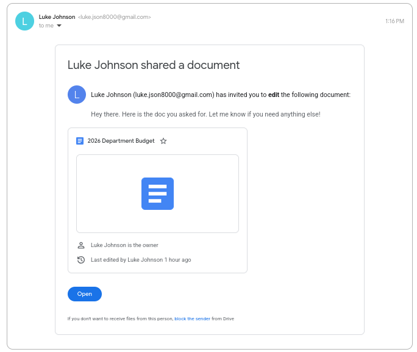
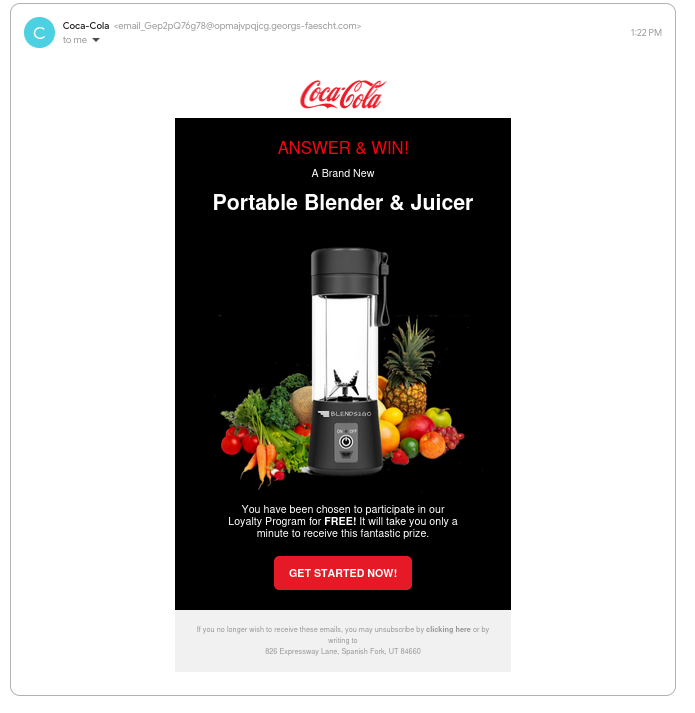
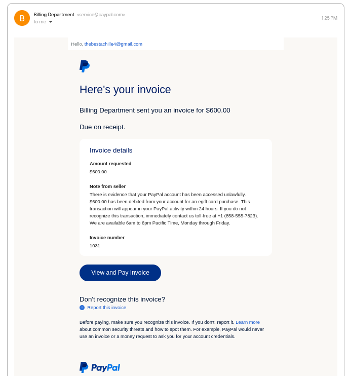
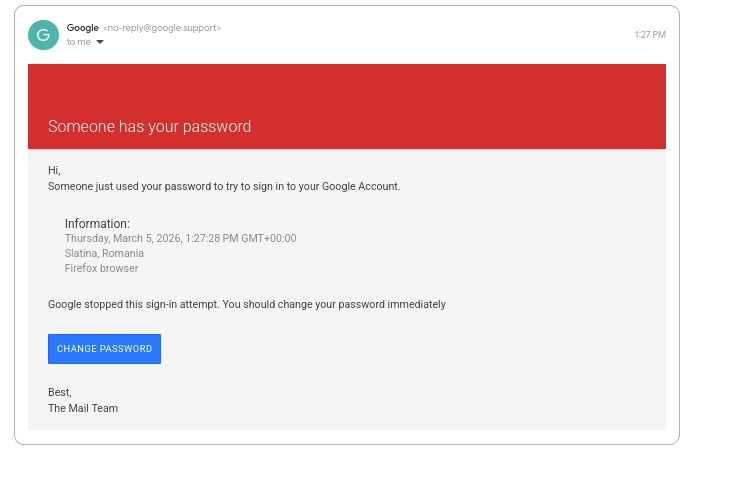
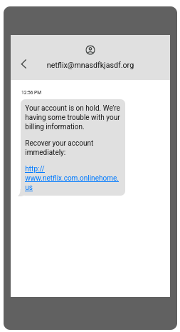

# Phishing Email Detection & Awareness Report

**Intern:** Hodome Kokou Achille
**Program:** Future Interns — Cyber Security Fellowship
**CIN:** FIT/MAR26/CS6617
**Date:** March 2026
**Task:** Task2 Phishing Email Detection & Awareness System

---

## Introduction

Phishing is one of the most widespread attack techniques used today. It targets people directly, exploiting trust and urgency rather than technical vulnerabilities. For this task, I collected real phishing examples from public sources, analyzed each one manually, and documented the indicators that give them away.

---

## Example 1 — Fake Google Drive Link

**Classification: Phishing**

Mousing over the link (or using a long press on mobile) reveals that it actually points to `drive--google.com` — a fake imitation domain, not the real `drive.google.com`. The double dash is the tell. The connection is also insecure (HTTP, not HTTPS). At a glance the link looks legitimate, but one extra second of attention exposes it completely.

---

## Example 2 — Fake Coca-Cola Promotion

**Classification: Phishing**

The email claims to come from Coca-Cola, but the sending address looks nothing like an official corporate domain. Beyond the sender, the entire content of the email is embedded as an image rather than actual text. While some legitimate marketing emails do this, it is a technique commonly used by attackers to bypass text-based spam filters.

The URL is also engineered to avoid detection — it uses a long redirect chain and hides the actual destination after a `#` character. Normally `#` is used to link to a specific section within a page, but here it is used to obscure the real landing destination from security tools while still delivering the user to the phishing page.

---

## Example 3 — Paypal note

**Classification: Phishing**

This one takes the form of a note from a seller. The message creates a false sense of urgency — a classic social engineering technique designed to push the target into acting before they have time to think critically.

The endgame here is not a link but a phone number. The attacker wants the victim to call, at which point the scam continues over the phone (a technique known as vishing — voice phishing). The email is just the first step.

---

## Example 4 — Fake Google Security Alert

**Classification: Phishing**

The sender display name says "Google Support" but the actual sending address does not match any official Google domain. When hovering over the "Change Password" button, the link resolves to a subdomain of `ml-security.org` — which has nothing to do with Google. The button is designed to look like a standard Google security prompt, but it leads directly to a credential harvesting page.

---

## Example 5 — Fake Netflix SMS

**Classification: Phishing**

This example comes via SMS rather than email. The sender address is a long, confusing email string — unusual for a legitimate service like Netflix, which typically sends SMS from a short code or verified number.

The URL is the most interesting part: it uses `netflix.com` as a subdomain of `onlinehome.us`. So the full domain looks like `netflix.com.onlinehome.us`. To a quick reader it looks like it came from Netflix, but the actual domain being visited is `onlinehome.us`, which is controlled by the attacker. This is a deceptive subdomain trick and such links should never be clicked.

---

## Summary

| Example | Description | Classification |
|---|---|---|
| 1 | Fake Google Drive link | Phishing |
| 2 | Fake Coca-Cola promotion | Phishing |
| 3 | Fake paypal note  | Phishing |
| 4 | Fake Google security alert | Phishing |
| 5 | Fake Netflix SMS | Phishing |

---

## How to Protect Yourself

Always check the actual sender address, not just the display name. Hover over any link before clicking to see where it really goes. Be suspicious of any message that creates urgency or asks you to call a number. Remember that a URL containing a brand name is not the same as coming from that brand — `netflix.com.onlinehome.us` is not Netflix. When in doubt, go directly to the official website by typing the address yourself.

---

*Task 2 — Future Interns Cyber Security Fellowship*
*All samples collected from public phishing databases for educational purposes*
